## When an N-Day turns into a 0day. (Part 1 of 2)
Written poorly by: b1ack0wl ❤️
#

# Table of Contents
* Background
* Finding the bug
  * Primitive Technique #1
  * Primitive Technique #2
* Bindiff
  * HTTPd Bindiff Analysis
  * Hostapd Bindiff Analysis
* Hunting for an overlapping function
* Exploitation
  * Environment
  * Exploitation (cont)
  * Object Hunting
* Notes


# Background

On June 23rd 2022 [Exodus Intelligence](https://www.exodusintel.com/) disclosed a [vulnerability](https://blog.exodusintel.com/2022/06/23/tp-link-wr940n-wr941nd-uninitialized-pointer-vulnerability/) that affected the WR940N V5 and WR941ND V6 routers made by TP-Link. This bug is labeled as an "Uninitialized Pointer Vulnerability", but I only had the WR940N V6 model on hand, so I decided to analyze the WR940N V5 firmware before looking at the V6 model. But during my analysis I noticed some gaps.


# Finding the bug

There are multiple ways to find this bug and none of them wrong since the end result is still the same. I will demonstrate two ways of finding this bug with some really primitive techniques.

## Primitive technique #1

The advisory by Exodus Intelligence details that the bug is triggered during `"the processing of UPnP/SOAP SUBSCRIBE requests"` which is detailed within the [UPnP Device Architecture 2.0 PDF](https://openconnectivity.org/upnp-specs/UPnP-arch-DeviceArchitecture-v2.0-20200417.pdf). The HTTP method listed within the advisory `SUBSCRIBE` is tied to the **GENA** (**G**eneral **E**vent **N**otification **A**rchitecture) portion of UPnP which is responsible for handling eventing which external devices can `SUBSCRIBE` and `UNSUBSCRIBE` to.

Performing a simple grep for `SUBSCRIBE` within the extracted firmware returns three binary files:

```
$ grep -r "SUBSCRIBE" .
Binary file ./sbin/hostapd matches
Binary file ./lib/libwpa_common.so matches
Binary file ./usr/bin/httpd matches
```

Before jumping into bindiff, it was decided to compare the hashes of the binaries to see if any binaries could be eliminated right off the bat. Although the hashing method used (MD5) is dubbed as "insecure" there are no known router vendors that perform MD5 hash collisions within their generated binaries at the time of this publication.

```
Unpatched FW (v.211111):
ef7abcd4f5a2289c24a50c9fa9fda8a1  ./sbin/hostapd
45725cdfe9ad7d8323c50167908acc23  ./lib/libwpa_common.so 
4dac0ec14e36001092cc2560f297a715  ./usr/bin/httpd


Patched FW (v.220610):
8aa55621c7277b7cc998ecc80fd9d6a4  ./sbin/hostapd
45725cdfe9ad7d8323c50167908acc23  ./lib/libwpa_common.so
4feb70561feb0391404ee29712b0144e  ./usr/bin/httpd
```
  
Hashing binaries and comparing them can be a waste of time, but in this case it helped elimate the file `./lib/libwpa_common.so` as the two MD5 hashes matched. This only leaves two files `./sbin/hostapd` and `./usr/bin/httpd`. From here we'll need to use Bindiff to figure out which binary contains the vulnerability.


## Primitive Technique #2

Let's go back and pretend that the advisory posted had the references to UPnP / GENA removed. This type of hypothetical does happen a lot with vulnerability advisories, for example [CVE-2014-4126](https://cvedetails.com/cve/CVE-2014-4126/) contains the following information: `"Microsoft Internet Explorer 10 and 11 allows remote attackers to execute arbitrary code or cause a denial of service (memory corruption) via a crafted web site, aka "Internet Explorer Memory Corruption Vulnerability."`.

Since the vulnerability is within a service then it may be a good strategy to start with making a list of executable files within the extracted firmware. By using `find` we can see how many files are marked as executable.

```
$ find . -executable -type f | wc -l
170
```

Yikes! At a first glance it appears that there's an awful lot of executable files within this firmware image, but what if something happened when `binwalk` was extracting the firmware? By looking at the `man` page for `find` it's possible to use the `-exec` action to perform additional tasks for each file found. By leveraging `file` it is possible to print the output of file next to each file name. After looking at the first few entries it was clear that some of the files returned were not ELF files.

```
$ find . -executable -type f -exec file '{}' \;
./etc/ath/wsc_config.txt: ASCII text
./etc/ath/default/default_wsc_cfg.txt: ASCII text
[removed]
./web/login/input-box1.png: PNG image data, 250 x 32, 8-bit/color RGBA, non-interlaced
[removed]
./web/help/WanSlaacCfgHelpRpm.htm: HTML document, ASCII text, with very long lines, with CRLF line terminators
```

To reduce the amount of files, the output of `find` is piped to `grep` to search for "ELF" within the output.

```
$ find . -executable -type f -exec file '{}' \; | grep "ELF 32-bit" -c
72
```

The list of executable files (which includes libraries) has been reduced by 58%, so the next step will be to to create a small bash command to hash the files and then compare them. It's a stretch, but it may help reduce the list even more.

To generate the lists the follow command is executed within each extracted `squashfs` directory.

```
$ find . -executable -type f -exec file '{}' \; | grep "ELF 32-bit" | cut -d ":" -f 1 | while read -r string; do md5sum $string; done
50a9bc41ebc4db4bcdf526b64e8b9ae2  ./bin/busybox
0781d8cd42137165f4b38eb67b41e07c  ./sbin/wifitool
e5d4b3d6d5ce16592b23c82a7872b97e  ./sbin/iwpriv
dd22c3d54c059547fabc4ce7d9c92adf  ./sbin/iwlist
9a71298edacef371a920509249373d06  ./sbin/iptables-multi
17dbb88ae25c0323984e754aa0628ed8  ./sbin/tc
4a9af1c3a57b36ef4e31542c9a1228aa  ./sbin/iwconfig
02dbb91d7fd6401158aea9021de72cf5  ./sbin/wpa_supplicant
ef7abcd4f5a2289c24a50c9fa9fda8a1  ./sbin/hostapd
c1efb3e78c002b7a82d2d28739bfcb1d  ./sbin/wlanconfig
e1aef559e8ccf27b79b83e05f577bd59  ./lib/ld-uClibc-0.9.30.so
45725cdfe9ad7d8323c50167908acc23  ./lib/libwpa_common.so
7c34616b9c965c7dd4f8e1b1f2d18d6f  ./lib/libip6tc.so.0.0.0
3d5625439ce9cd389bd3b7ebcc3eb6e1  ./lib/libxtables.so.2.1.0
368cd21ea41bcece3ecd41335fcbba97  ./lib/libwolfssl.so.14.0.0
452a4826c92c8a51284af5007d9a6db8  ./lib/libiptc.so.0.0.0
b3a33a68a1ef0cfa2a5bd6878d2e3310  ./lib/libwpa_ctrl.so
[...etc]
```
Running `diff` on the two files results in the following:

```
$ diff unpatched_executables_md5.txt patched_executables_md5.txt 
< 9060164431357066c3607ebc476761c6  ./bin/busybox
---
> 50a9bc41ebc4db4bcdf526b64e8b9ae2  ./bin/busybox
9c9
< 8aa55621c7277b7cc998ecc80fd9d6a4  ./sbin/hostapd
---
> ef7abcd4f5a2289c24a50c9fa9fda8a1  ./sbin/hostapd
60c60
< 4feb70561feb0391404ee29712b0144e  ./usr/bin/httpd
---
> 4dac0ec14e36001092cc2560f297a715  ./usr/bin/httpd
```

The list of 72 files has now been reduced to just 3 files! The next step is to run these files through `Binexport` and then into `Bindiff`.

# Bindiff

Between the two primitives techniques, the files `/sbin/hostapd` and `/usr/bin/httpd` are in both lists while the file `/bin/busybox` only exists within one of the lists. To increase the chances of finding the bug, the files `hostapd` and `httpd` will be looked at first while leaving `busybox` for last or even at all.

## HTTPd Bindiff Analysis

Beginning with `httpd` and sorting the `Bindiff` analysis by descending similarity score, it was found that most of the functions analyzed were bogus (aka full of MIPS NOP instructions. NOP = 0x00000000) or associated with WAN related connections. After about 15 minutes, the functions analyzed there are no instructions related to initializing a local variable. (e.g. `sw $zero ($sp)`).

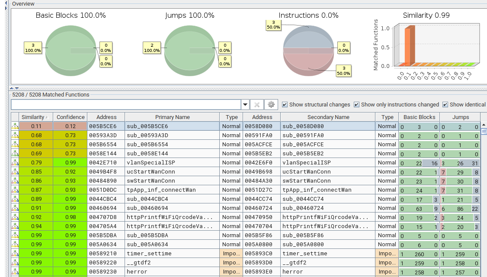

It was time to move on to the next binary `hostapd`.

# Hostapd Bindiff Analysis

When analyzing at the bindiff output for `hostapd` with a descending similarity score only one function stood out and that was`sub_004498D4`.

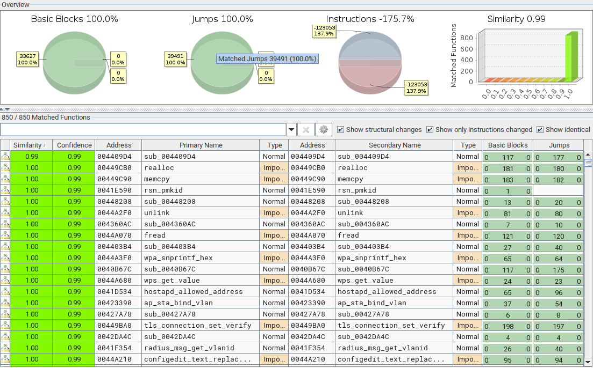

When looking at the differences only one instruction was shown to be different.

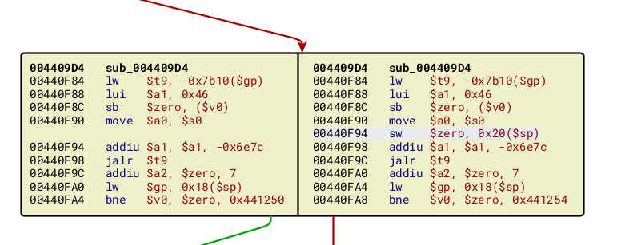

The insturction `sw $zero 0x20($sp)` means to **s**tore **w**ord (4 bytes) from the $zero register which is always set to `0x00000000` into the local variable at offset `0x20`. This instruction means that the local variable at offset `0x20` was never initialized. (e.g. `int foo = 0;` vs `int foo;`)

When looking at the call graph of this function it was obvious that this function is a parser of some sort due to the loops and edges.

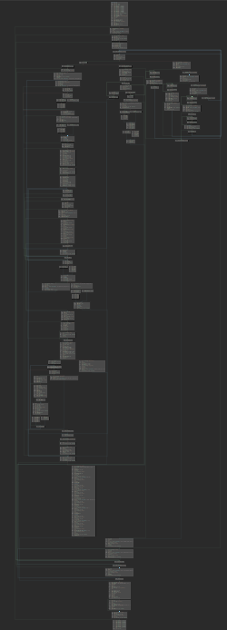

When looking closer into function and by leveraging `HLIL` it appears that this particular function parses HTTP requests of some sort. The usage of `strstr()` to look for a newline char (0x0a) and with the `strncasecmp()` statements it appears that this is function is responsible for handling `GENA` subscription requests.

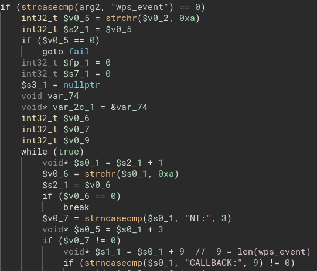

Seeing that this function handles incoming subscriptions and the only modification is a local variable being initialized. This appears to be a good place to begin as the modification screams to me **UNINITIALIZED STACK-BASED VARIABLE!!** which resides within a parser. The next step is to see what this variable is used for.


In MIPS the register `$a0` is normally used as the first argument when calling a function (equivalent of `$r0` in ARMv7). So looking for instructions that load from the stack and into the `$a0` register is a very good place to start. Starting with the first reference at `0x00441250` the following instructions are displayed.


Going one line at a time the following is happening:
* `$a0` is populated with a DWORD from the stack at offset 0x20.
* If `$a0` is NULL then a branch the call to `freeaddrinfo()` is bypassed.
* If `$a0` is not NULL then the value is passed to `freeaddrinfo()`.

This is a textbook example of an uninitalized stack-based pointer vulnerability. If an arbitrary value can be written to this stack frame then an undefined value can end up being passed to `freeaddrinfo()`.


The second reference to using `$a0` may seem like it's being used for another function which could initalize this pointer, but the disassembly shows that the `$a0` register gets overwritten with the value from register `$s4` before calling `free()`. (Note: Don't forget to include the `delay slot` when analyzing this snippet ;) )

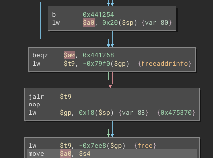

The next step is to find a function that overlaps with this stack frame, so that we can achieve an arbitrary free primitive.

# Hunting for an overlapping function

Going backwards we find that there are 2 other functions which are called before arriving at `sub_4409d4`.

```
1 - sub_443124 addiu $sp, $sp, -0x20
2 - sub_4419f4 addiu $sp, $sp, -0xa0
3 - sub_4409d4 addiu $sp, $sp, -0xa0
```

When`sub_4409d4` is called the stack is adjusted by a total of`-0x160`. So we need to find a function that overlaps with `-0x160 + 0x20` in order to hit the uninitalized area.

The first thing I wanted to analyze was how the `SSDP` stack works within this binary since it's part of the UPnP protocol. The function `sub_444d84` was found by looking for the string `M-SEARCH`. Again, by leveraging HLIL it's apparent that the function is responsible for parsing incoming SSDP requests which are sent over UDP multicast.


What really sticks out to me is how large the destination buf is, especially since it follows the pattern of using the macro `sizeof(buf)-1` within the `len` parameter which indicated to me a stack-based variable of 1600 bytes is being used to `recv` SSDP data. When looking at the disassembly the stack is adjusted by `-0x6a8` and the `buf` parameter is indeed a stack-based buffer of 1600 bytes.

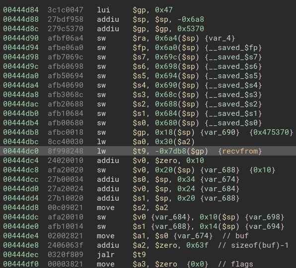

The SSDP function's stack frame resides at `-0x6a8`, the buf used for `recvfrom()` resides at `-0x6a8+0x34`, and our vulnerable buffer is at `-0x160+0x20`. The `recvfrom()` function will read from the UDP socket for up to 1599 bytes which is `0x63f` in hex. If we were to populate the entire `char buf[1600];` buffer then we'll be writing from `-0x674` all the way to `-0x35` which means that this stack-based buffer overlaps with our vulnerable function. Since `recvfrom()` does not have any character limitations it is a great place to start!


# Triggering the vulnerability

From the previous analysis it was determined that the vulnerable function lies within the `GENA` stack and can provide a powerful primitive, but we need to go backwards from the vulnerable `freeaddrinfo()` call and figure out how to get to there. I originally used `HLIL` to speed up this process and the following is the call flow in order to hit the vulnerable area.

Starting from the entry of the function it appears that there's a check for the string `wps_event` which by assumption may be the subscription URI. (e.g. `SUBSCRIBE /wps_event HTTP/1.1`).


To help reduce complexity within this blog post the next checks look for the headers `CALLBACK:` and `NT:` which must be present within an original subscription request (this is defined within the UPnP protocol PDF). The value of `NT:` must be set to `upnp:event` before the value of `CALLBACK:` is parsed.

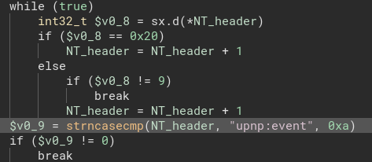

Once the check for the substring `upnp:event` passes (aka strncasecmp() retuns 0) then the value of the `CALLBACK` HTTP header is parsed.

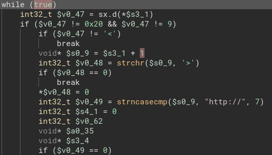

The format of the `CALLBACK` header is as follows:

```
CALLBACK: <http://{host}:{port}/{path}>
```

But what happens if the `strncasecmp()` returns non-NULL? This means changing the string `http://` within the CALLBACK header to anything else. (e.g. `0wl://`).


Woah! Based on the HLIL output it looks like there's a value being set that needs to be avoided? But when switching back to `Disassembly` mode it's obvious that HLIL  an be a little misleading.

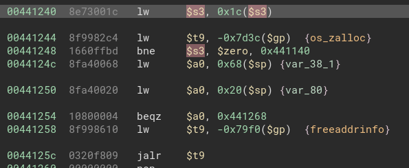

The register `$a0` appears to be loaded with another local variabled located at offset `0x68`, but if the branch is not taken then `$a0` is overwritten with the value from `0x20` which is the vulnerable offset.

With all of this information it appears that if we send the following requests then we should crash:

**SSDP**: (Fill up the overlapping stack frame)
```
(M-SEARCH * HTTP/1.1) + ("A" * offset) + (DWORD for freeaddrinfo()) 
```

**GENA**: (Trigger call to freeaddrinfo())
```
SUBSCRIBE /wps_event HTTP/1.1
NT: upnp:event
CALLBACK: <0wl://>
```

**NOTE**: Within the UPnP specification `SUBSCRIBE` requests must have the HTTP header `TIMEOUT` set to `Second-{int}`, but the parser for this removes this requirement and sets the Timeout value to `1801` seconds. I've personally never seen this oddity within other UPnP implementations before.

With GDB attached to `hostapd` the two requests are sent which results in the following:

```
Program received signal SIGSEGV, Segmentation fault.
0x2ab734cc in ?? ()
(gdb) x/1i $pc
=> 0x2ab734cc:  jalr    t9
   0x2ab734d0:  lw      s0,28(s0)
(gdb) i r $s0 $a0
s0: 0x41424344
a0: 0x41424344
```

This looks like the crash we've been aiming for! But where are we?! By pulling up the Memory Maps the value of `$PC` lies within `/lib/libuClibc-0.9.30.so` which resides within the area of `0x2ab2d000-0x2ab8a000`. 

```
Start Addr   End Addr       Size     Offset objfile
0x400000   0x45d000    0x5d000        0x0 /sbin/hostapd
0x46d000   0x46e000     0x1000    0x5d000 /sbin/hostapd
0x46e000   0x47c000     0xe000        0x0 [heap]
0x2aaa8000 0x2aaad000     0x5000        0x0 /lib/ld-uClibc-0.9.30.so
0x2aaad000 0x2aaae000     0x1000        0x0 
0x2aabc000 0x2aabd000     0x1000     0x4000 /lib/ld-uClibc-0.9.30.so
0x2aabd000 0x2aabe000     0x1000     0x5000 /lib/ld-uClibc-0.9.30.so
0x2aabe000 0x2aae2000    0x24000        0x0 /lib/libwpa_common.so
0x2aae2000 0x2aaf1000     0xf000        0x0 
0x2aaf1000 0x2aaf2000     0x1000    0x23000 /lib/libwpa_common.so
0x2aaf2000 0x2ab1c000    0x2a000        0x0 /lib/libgcc_s.so.1
0x2ab1c000 0x2ab2c000    0x10000        0x0 
0x2ab2c000 0x2ab2d000     0x1000    0x2a000 /lib/libgcc_s.so.1
0x2ab2d000 0x2ab8a000    0x5d000        0x0 /lib/libuClibc-0.9.30.so
0x2ab8a000 0x2ab99000     0xf000        0x0 
0x2ab99000 0x2ab9a000     0x1000    0x5c000 /lib/libuClibc-0.9.30.so
0x2ab9a000 0x2ab9b000     0x1000    0x5d000 /lib/libuClibc-0.9.30.so
0x2ab9b000 0x2aba0000     0x5000        0x0 
0x7fd5b000 0x7fd70000    0x15000        0x0 [stack]
```

By subtracting the base address with the value of `$PC` (`0x2ab734cc-0x2ab2d000`) we get an offset value of `0x464cc`. Loading `/lib/libuClibc-0.9.30.so` into Binary Ninja and jumping to offset `0x464cc` shows that the value of `$PC` is currently pointing into the function `freeaddrinfo()`.

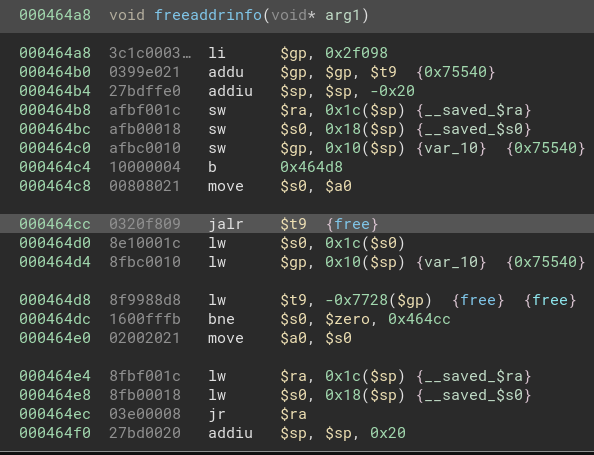

Here's an alternative perspective for those who prefer Graph View.

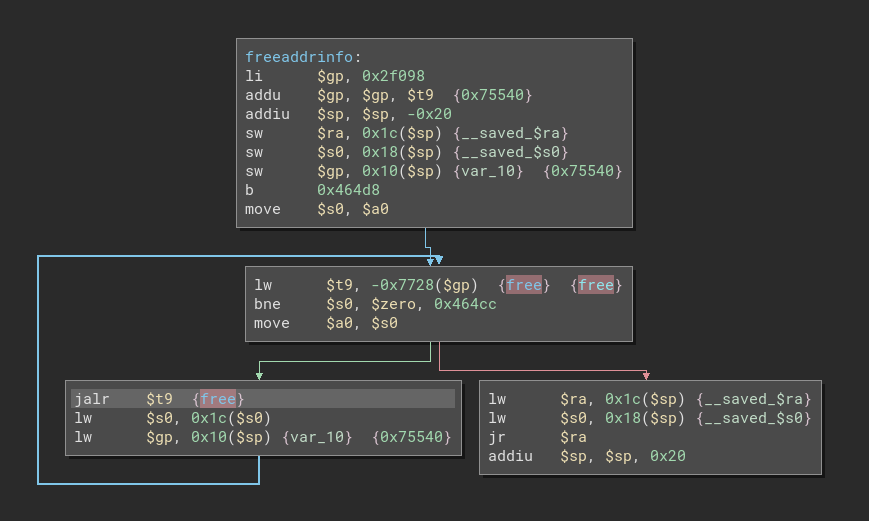

Upon entry of `freeaddrinfo()` the value of `$a0` is copied into register `$s0` which then loops over and over until `$s0` is equal to `0x00000000`. This means that this function frees a linked list with the `next` pointer sitting at offset `0x1c`. If the dereffed value of `0x1c($s0)` is set to NULL then the return branch is taken. 

From this code snippet it appears that we can free arbitrary allocations, but the value at offset `0x1c` must be set to NULL or set to an allocation that can be freed. This actually limits the amount of allocated structs that can freed. So, if trying to leverage this vulnerability to cause a UaF is limiting, what else can be done?!

# Exploitation

Before getting into how `$PC` control can be achieved, it is important to go over the ideas that failed:
* Every TCP connection contains an allocation with a struct that contains function pointers! Unfortunately at offset `0x1c` there's an int that does not point to allocated memory :(
* Subscriptions are allocated within the heap as well! But unfortunately the allocations also have values at offset `0x1C` that do not point to valid memory addresses.

Going back to that TCP connection struct. Instead of trying to perform a UaF what if we could make an allocation within an allocation that we control? Before going down that janky road it is important to look at the environment for securtiy mitigations (e.g. ASLR, NX, CFG...etc).

## Environment

Checking the `maps` of the process will immediately show if `NX` is enabled or not.

```
# cat /proc/465/maps
00400000-0045d000 r-xp 00000000 1f:02 239        /sbin/hostapd
0046d000-0046e000 rw-p 0005d000 1f:02 239        /sbin/hostapd
0046e000-00473000 rwxp 00000000 00:00 0          [heap]
[removed]
7fa06000-7fa1b000 rwxp 00000000 00:00 0          [stack]
```

The stack and heap are executable! It's like Windows XP pre SP2 days! The next check is to look for `ASLR` which is found by looking at the value of `randomize_va_space`.

```
# cat /proc/sys/kernel/randomize_va_space 
1
```

The value of `1` is defined as `Randomize the positions of the stack, virtual dynamic shared object (VDSO) page, and shared memory regions. The base address of the data segment is located immediately after the end of the executable code segment.` But there's an issue. After many reboots and reflashes it appears that `1` on this router means that ASLR is 100% off! Hooray for devices that handle network traffic having worse security than Windows Vista.

## Exploitation (cont)

To recap, the following has been determined:
* Both ASLR and NX are off!
* The start of the address for the heap is always the same.
* The bug contains no character limitations.
* This is the perfect storm 😈

The previous idea of making a fake busy heap allocation seems like it could work, but how and where?!?!

From pure blackbox testing it was discovered that the body of `POST` messages always reside within heap address `0x46e100` and also does not contain character restrictions! ❤️

To make a fake heap allocation it is required to look at `free()` to see what it needs in order to successfully free an allocation. But to speed up this blog post the following is required:
* Allocation -4 must contain the size + in-use flag (LSB)
* Allocation -8 must be set to NULL for simplicity
* Allocation must pass the unlink check.

If all of these are met then the allocation will be freed and placed within a `freelist` and bucketed. Since there's complete control of the fake allocation, the next step is to find structs that contain function pointers that can be clobbered. From earlier it was noted that TCP connections allocate structs within the heap that contain function pointers, but how are they triggered?

Incoming TCP connections are handled by function `sub_44004c` within `hostapd`.

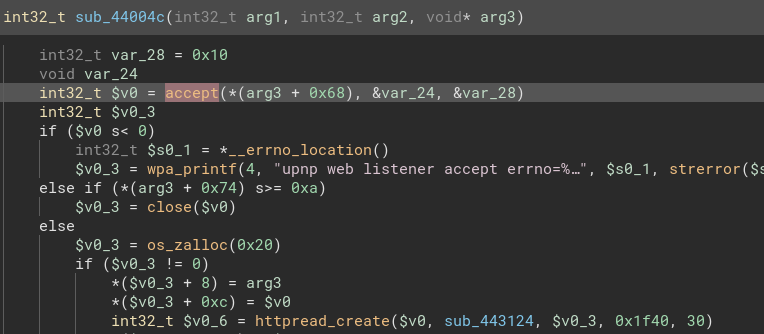

If the call to `accept()` is successful then a call to `httpread_create()` is performed.

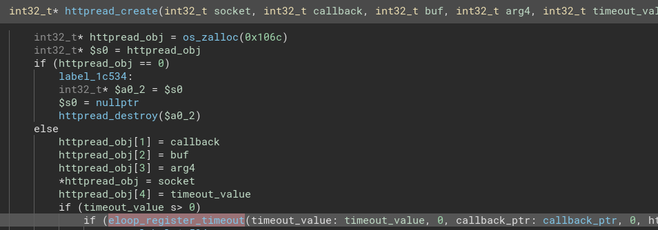

 The function `eloop_register_timeout()` is the function that allocates the struct which contains a function pointer which is shown below.

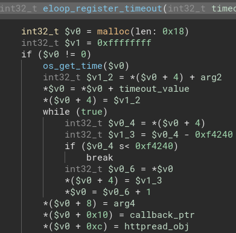


The function pointer is saved at offset `0x10` while the timeout value resides at offset `0x00`. The function `eloop_run()` is responsible for handling these allocations to ensure that the TCP connections get destroyed after 30 seconds of inactivity. Once the timeout has occured then the function ptr at offset `0x10` is called.

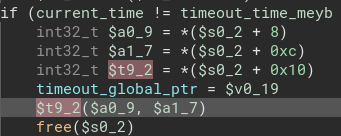

# Putting it all together

To successfully exploit this vulnerability the following steps have to be performed in order:
* Send a multicast SSDP message to fill up the stack with arbitrary values
* Send a POST request with the body containing the bytes needed to create a fake heap allocation.
* Send a `SUBSCRIBE` request with the `CALLBACK` HTTP header's value set to a URI hander that is not `http://` to trigger the call to `freeaddrinfo()`
* Connect multiple TCP sockets without sending anything to cause the allocation from `eloop_register_timeout()` to occur and occupy the freed fake block.
* Send a final POST request to clobber the `eloop_register_timeout()` struct to set the timeout to `0` and the function ptr to anything we want.
* Gain `$PC` control :D


# Demonstration

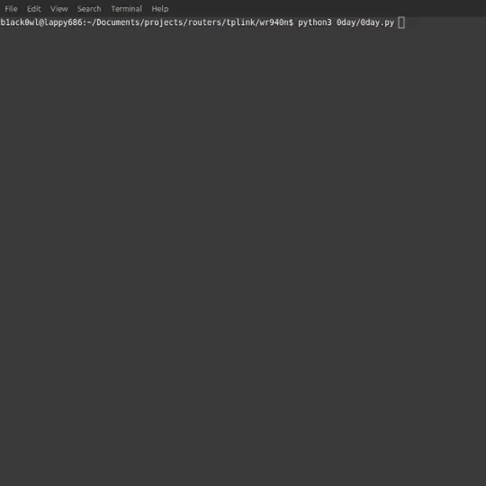

# Notes
* After analyzing the V5 firmware I saw that the V6 model of the WR940N was not patched until November 21st 2022. For some reason only two specific models were patched back in June, but the V6 version of the WR940N was left vulnerable. I can only assume that TP-Link is relying on bug submitters to tell them which devices are impacted, but this is pure speculation since the patch gap on the newer model is a bit odd.
* The binary `httpd` runs a differrent implementation of UPnP, but sends a few `M-SEARCH` SSDP packets every 30 seconds. If the packet generated by `httpd` is received then the exploit will fail. It is best to listen to SSDP multicast traffic to find a window before sending other SSDP packets. 
* It is also possible to trigger this vulnerability by getting `getaddrinfo()` to return a non-null value. By populating the `{host}` portion of the `CALLBACK` HTTP header with a FQDN that does not resolve (e.g. `<http://0wl.0wl/>`), the vulnerable call to `freeaddrinfo()` will also occur.


 Part 2 of this blog post will focus on creating process continuation shellcode since `hostapd` handles WiFi connections and once the binary dies then the WiFi stops working which is a horrible IOC. We will fix this in `Part 2` ❤️

[0wl] 🦉